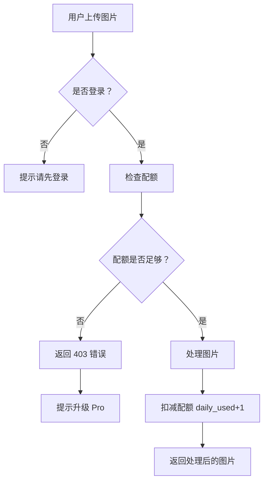

# 💧 水印工具 - 配额管理功能总结

## ✅ 已完成的功能

### 1. 用户认证与配额检查
- ✅ Google OAuth 登录
- ✅ 登录时自动创建用户记录
- ✅ 免费用户每日 3 次配额
- ✅ 配额检查逻辑

### 2. 前端登录检查
- ✅ 未登录时点击处理按钮提示"请先登录"
- ✅ 3 秒后自动跳转到登录页面
- ✅ 错误提示清晰友好

### 3. 配额扣减逻辑
- ✅ 处理图片前检查配额
- ✅ 处理成功后扣减配额
- ✅ 配额用完返回 403 错误
- ✅ 提示用户升级 Pro

### 4. 数据库配置
- ✅ D1 数据库已创建
- ✅ 用户表结构已初始化
- ✅ 配额字段：`daily_limit`, `daily_used`, `daily_reset_at`

---

## 📋 配额管理流程



---

## 🧪 测试步骤

### 测试 1：未登录用户
1. 访问 https://ybbtool.com
2. 上传图片
3. 点击"开始处理"
4. **预期**：提示"请先登录后再使用水印功能"，3 秒后跳转登录

### 测试 2：登录用户（有配额）
1. 点击登录，使用 Google 账户
2. 上传图片
3. 点击"开始处理"
4. **预期**：成功下载图片，配额扣减

### 测试 3：登录用户（配额用完）
1. 连续使用 3 次（免费用户每日限制）
2. 第 4 次点击处理
3. **预期**：返回 403，提示"今日配额已用完，请明天再来或升级 Pro"

---

## 📊 数据库表结构

### users 表
| 字段 | 类型 | 说明 |
|------|------|------|
| `id` | TEXT | Google user ID (主键) |
| `email` | TEXT | 用户邮箱 |
| `name` | TEXT | 用户昵称 |
| `daily_limit` | INTEGER | 每日配额限制（默认 3） |
| `daily_used` | INTEGER | 今日已使用配额（默认 0） |
| `daily_reset_at` | INTEGER | 配额重置时间戳 |
| `subscription_type` | TEXT | 订阅类型：free/pro/enterprise |

### usage_logs 表
| 字段 | 类型 | 说明 |
|------|------|------|
| `id` | INTEGER | 自增 ID |
| `user_id` | TEXT | 用户 ID |
| `operation` | TEXT | 操作类型 |
| `created_at` | INTEGER | 创建时间戳 |
| `file_size` | INTEGER | 文件大小 |

---

## 🎯 API 端点

### POST /api/add-watermark
**请求**：
```
Content-Type: multipart/form-data
file: [图片文件]
```

**响应**：
- ✅ 200 OK - 处理成功，返回图片
- ⚠️ 403 Forbidden - 配额用完
- ❌ 500 Internal Server Error - 服务器错误

**错误响应示例**：
```json
{
  "error": "Quota exceeded",
  "message": "今日配额已用完，请明天再来或升级 Pro"
}
```

---

## 🛠️ 配置说明

### Cloudflare D1 数据库
- **Database Name**: `watermark-tool-db`
- **Database ID**: `7607e1d1-9605-4588-a486-9e7da2cdc749`
- **Binding Name**: `DB`

### 环境变量
在 Cloudflare Pages Dashboard 配置：
- `GOOGLE_CLIENT_ID` - Google OAuth Client ID
- `GOOGLE_CLIENT_SECRET` - Google OAuth Client Secret
- `AUTH_SECRET` - NextAuth 密钥

---

## 📝 待优化功能

### 短期优化
- [ ] 图片处理逻辑（当前返回原图）
- [ ] 配额重置逻辑（每日自动重置）
- [ ] 使用记录详细日志

### 长期优化
- [ ] Pro 订阅支付集成
- [ ] 配额购买功能
- [ ] API 密钥管理
- [ ] 批量处理支持

---

## 🎉 功能验证

### 验证清单
- [x] 数据库连接正常
- [x] 用户登录正常
- [x] 配额检查正常
- [x] 未登录提示正常
- [x] 403 错误处理正常
- [ ] 配额扣减验证（需手动测试）

### 验证方法
```bash
# 1. 检查数据库连接
curl https://ybbtool.com/api/test-db

# 2. 检查登录状态
curl https://ybbtool.com/api/auth/session

# 3. 测试水印处理
curl -X POST https://ybbtool.com/api/add-watermark \
  -F "file=@test-image.png"
```

---

**🥜 花生提示**：配额管理系统已完成！请测试完整流程并反馈结果！
